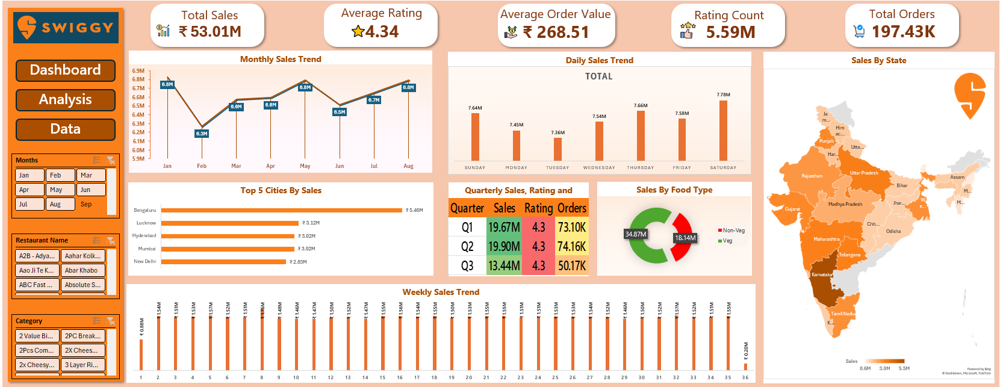

# Swiggy Sales Dashboard & Analysis (Excel)

## 📊 Project Overview
This project demonstrates a **real-world sales analysis and dashboard** built using **Microsoft Excel** with data inspired by Swiggy — India’s leading food delivery platform.  
The goal is to extract business insights from raw sales data and turn them into **interactive visualizations** using pivot tables, slicers, and custom charts to help stakeholders understand performance trends and key metrics.

---

## 🛠️ Tools & Technologies
- **Microsoft Excel** (Pivot Tables, Charts, Slicers, Formulas)
- **Data Cleaning & Transformation**
- **Dashboard Design & KPI Metrics**

---

## 📌 Key Features
- **Data Cleanup & Preparation:** Standardized, filtered, and transformed the raw dataset for meaningful analysis.  
- **KPI Metrics:**  
  - Total Sales Revenue  
  - Average Rating  
  - Average Order Value  
  - Total Orders  
- **Interactive Dashboard:**  
  - Trend charts by month and day  
  - Breakdown by food type (veg/non-veg)  
  - Regional sales comparison  
  - Dynamic slicers for filters  

---

## 📈 Business Insights
- Identified **high-performing cities and sales patterns**  
- Observed variation in **customer ordering behavior** over time  
- Uncovered **top categories and trends** that inform strategic planning  

---

## 👤 Author
**Prajowal Karki**
